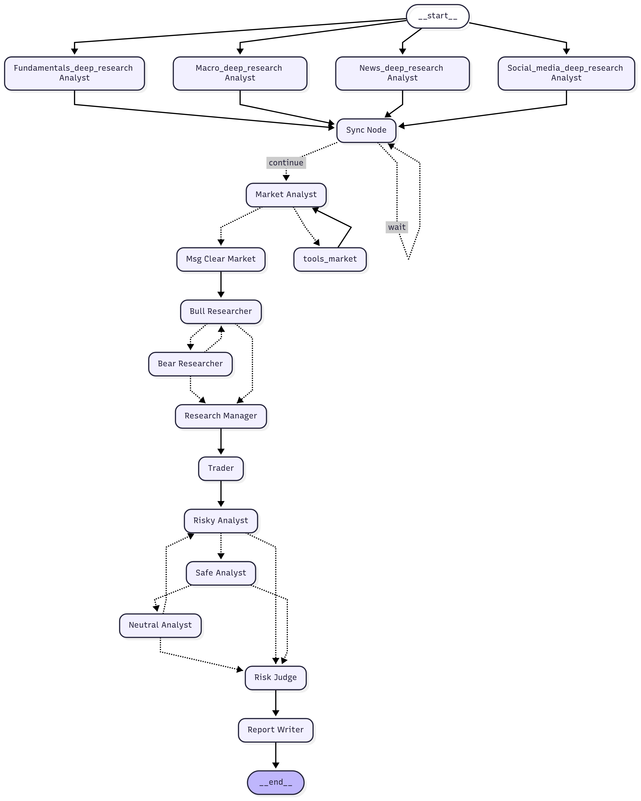

# TradingAgents with Deep Research Integration

## 项目概述

本项目是基于两个开源项目的深度整合：
- [TauricResearch/TradingAgents](https://github.com/TauricResearch/TradingAgents): 多智能体金融交易框架
- [langchain-ai/open_deep_research](https://github.com/langchain-ai/open_deep_research): 深度研究分析系统

通过将深度研究能力集成到投研智能体中，本项目构建了一个更加全面和深入的金融分析与交易决策系统。该系统不仅具备传统的技术分析、基本面分析、情绪分析和新闻分析能力，还引入了深度研究机制，能够对特定主题进行更加深入和全面的调研。

## 快速开始

### 运行入口

在运行项目之前，需要先配置环境变量：

```bash
# 复制环境变量模板文件
cp .env.example .env

# 编辑 .env 文件，添加必要的API密钥
# 例如：OPENAI_API_KEY、FINNHUB_API_KEY等
```

项目的主要运行入口是 `main.py`：

```python
# 使用 uv 运行
uv run main.py
```

### 当前配置

当前版本的 `selected_analysts` 仅支持 **market analyst**，这是为了专注于技术分析能力的优化。未来版本将逐步支持更多分析师类型。

```python
# main.py 中的配置
ta = TradingAgentsGraph(
    selected_analysts=["market"],  # 当前仅支持市场分析师
    selected_deep_researcher=["social_media_deep_research", "news_deep_research", "fundamentals_deep_research"],
    debug=config["debug"],
    config=config
)
```

## 系统架构

<p align="center">
  
</p>

本系统采用多智能体协作架构，通过专业化分工和动态协作来实现全面的投资研究和交易决策。整个架构可以分为以下几个层次：

### 1. 数据采集与分析层 (Analyst Team)

#### 常规分析师 (Regular Analysts)
这些分析师负责基础的市场数据收集和初步分析：

- **Market Analyst (市场分析师)**
  - **功能**: 技术指标分析和市场趋势研究
  - **工具**: 移动平均线(SMA/EMA)、MACD、RSI、布林带、ATR、成交量加权移动平均(VWMA)等
  - **输出**: 详细的技术分析报告，包含趋势判断和关键指标分析
  - **特点**: 选择最相关的8个指标进行互补性分析，避免冗余

- **Social Media Analyst (社交媒体分析师)**
  - **功能**: 社交媒体情绪分析和公司特定新闻研究
  - **数据源**: Reddit、Twitter等社交平台的股票讨论
  - **输出**: 公众情绪报告和社交媒体趋势分析

- **News Analyst (新闻分析师)**
  - **功能**: 全球新闻和宏观经济指标分析
  - **数据源**: 主流财经媒体、政策发布、行业新闻
  - **输出**: 新闻事件对市场影响的综合分析报告

- **Fundamentals Analyst (基本面分析师)**
  - **功能**: 公司财务数据和基本面信息分析
  - **数据源**: 财务报表、内部人士交易、公司公告
  - **输出**: 公司基本面健康度和价值评估报告

#### 深度研究分析师 (Deep Research Analysts)
这些分析师利用深度研究系统进行更加全面和深入的专题分析：

- **Social Media Deep Research Analyst (社交媒体深度研究分析师)**
  - **功能**: 广域社交媒体信息收集与深度情绪分析
  - **研究范围**: 微博、雪球、知乎、Reddit、Twitter等多平台
  - **分析维度**: 
    - 公众讨论与情绪变化趋势
    - 关键事件催化剂识别
    - 媒体报道与社媒观点一致性分析
    - 情绪刻度量化(-2到+2)
  - **输出**: 结构化的深度社交媒体研究报告，包含逐日时间线、情绪区间综述、主题洞察等

- **News Deep Research Analyst (新闻深度研究分析师)**
  - **功能**: 权威新闻事件的深度收集与影响分析
  - **数据源**: 权威财经媒体、国际主流媒体、官方公告、券商研报
  - **分析框架**:
    - 重大新闻事件识别与分类
    - 多源验证与事实核查
    - 政策监管动态分析
    - 业务经营新闻跟踪
  - **输出**: 新闻事件时间线、政策影响评估、媒体可信度分析

- **Fundamentals Deep Research Analyst (基本面深度研究分析师)**
  - **功能**: 财务数据的深度挖掘与估值建模
  - **数据源**: 官方财务数据、专业数据平台、券商研报、行业数据
  - **分析维度**:
    - 财务质量深度分析
    - 盈利能力可持续性评估
    - 成长性驱动因素识别
    - 估值合理性多维度对比
  - **输出**: 基本面评级、财务健康度分析、同业对比、投资价值评估

### 2. 研究辩论层 (Research Team)

- **Bull Researcher (多头研究员)**
  - **功能**: 构建看涨论证，强调增长潜力和竞争优势
  - **策略**: 利用正面指标和市场机会，反驳空头观点
  - **记忆机制**: 从历史决策中学习，避免重复错误

- **Bear Researcher (空头研究员)**
  - **功能**: 构建看跌论证，强调风险和挑战
  - **策略**: 识别潜在威胁和竞争劣势，质疑乐观假设
  - **记忆机制**: 基于过往经验优化风险识别能力

- **Research Manager (研究总监)**
  - **功能**: 主持多空辩论，做出最终投资建议
  - **决策过程**: 综合评估辩论双方论点，形成明确的BUY/HOLD/SELL建议
  - **输出**: 详细的投资计划和实施策略

### 3. 交易执行层 (Trading Team)

- **Trader (交易员)**
  - **功能**: 基于研究团队的投资计划制定具体交易方案
  - **输入**: 所有分析师报告和研究团队的投资建议
  - **输出**: 明确的交易提案(BUY/HOLD/SELL)
  - **学习能力**: 从历史交易结果中总结经验教训

### 4. 风险管理层 (Risk Management Team)

- **Risky Analyst (激进风险分析师)**
  - **功能**: 倡导高风险高收益策略
  - **观点**: 强调增长潜力和竞争优势，质疑过度保守的策略
  - **辩论策略**: 用数据驱动的反驳来挑战保守观点

- **Safe Analyst (保守风险分析师)**
  - **功能**: 优先考虑资产保护和稳定增长
  - **观点**: 强调风险缓解和长期可持续性
  - **辩论策略**: 识别高风险因素，提出谨慎替代方案

- **Neutral Analyst (中性风险分析师)**
  - **功能**: 提供平衡视角，权衡收益与风险
  - **观点**: 倡导适度风险策略，避免极端立场
  - **辩论策略**: 挑战激进和保守观点，寻求最佳平衡点

- **Risk Judge (风险总监)**
  - **功能**: 主持风险辩论，对交易员提案进行最终风险评估
  - **决策权**: 批准或拒绝交易提案
  - **输出**: 最终的交易决策和风险调整建议

## 工作流程

1. **并行分析阶段**: 所有分析师(包括深度研究分析师)同时开始工作
   - 常规分析师进行基础数据收集和分析
   - 深度研究分析师进行专题深度调研

2. **研究辩论阶段**: Bull和Bear研究员基于所有分析师的报告进行辩论
   - 多轮动态辩论，直到达到设定轮数或Research Manager介入
   - Research Manager综合评估并形成投资建议

3. **交易决策阶段**: Trader基于投资建议制定交易方案

4. **风险评估阶段**: 三类风险分析师对交易方案进行多角度评估
   - 多轮风险辩论，全面评估潜在风险
   - Risk Judge做出最终批准或拒绝决定

## 技术特性

- **LangGraph架构**: 基于LangGraph构建的模块化智能体系统
- **并行处理**: 多个分析师可以并行工作，提高效率
- **记忆机制**: 各个智能体具备学习和记忆能力，能够从历史决策中改进
- **深度研究集成**: 结合open_deep_research的深度调研能力
- **动态辩论**: 支持多轮动态辩论机制
- **可配置性**: 支持灵活的分析师组合和参数配置

## 配置说明

系统通过 `DEFAULT_CONFIG` 进行配置，主要参数包括：

- **LLM设置**: 支持OpenAI、Anthropic、Google等多种LLM提供商
- **辩论轮数**: 可配置投资辩论和风险辩论的最大轮数
- **工具选择**: 支持在线工具和离线缓存数据两种模式
- **调试模式**: 支持详细的执行过程追踪